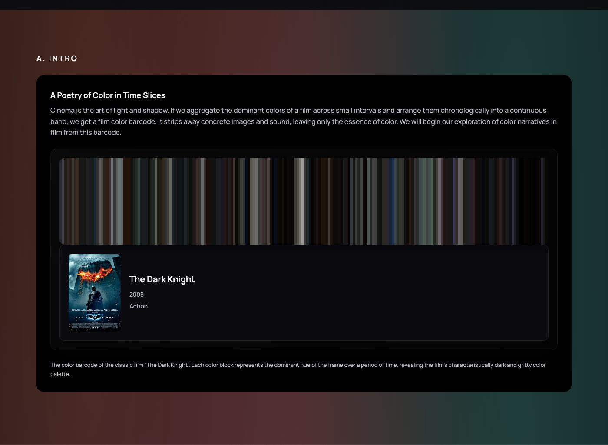
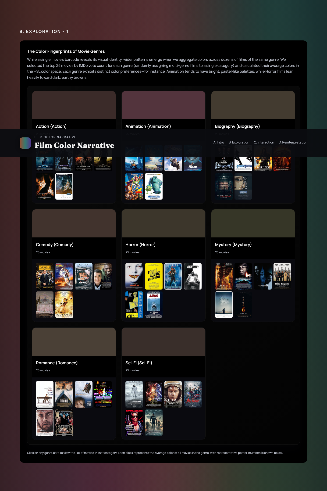
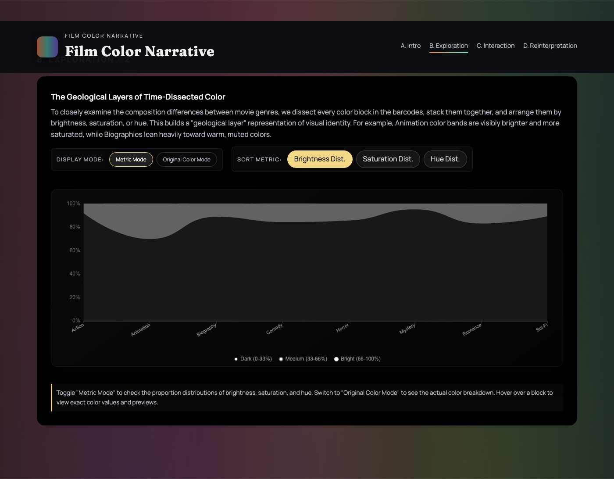
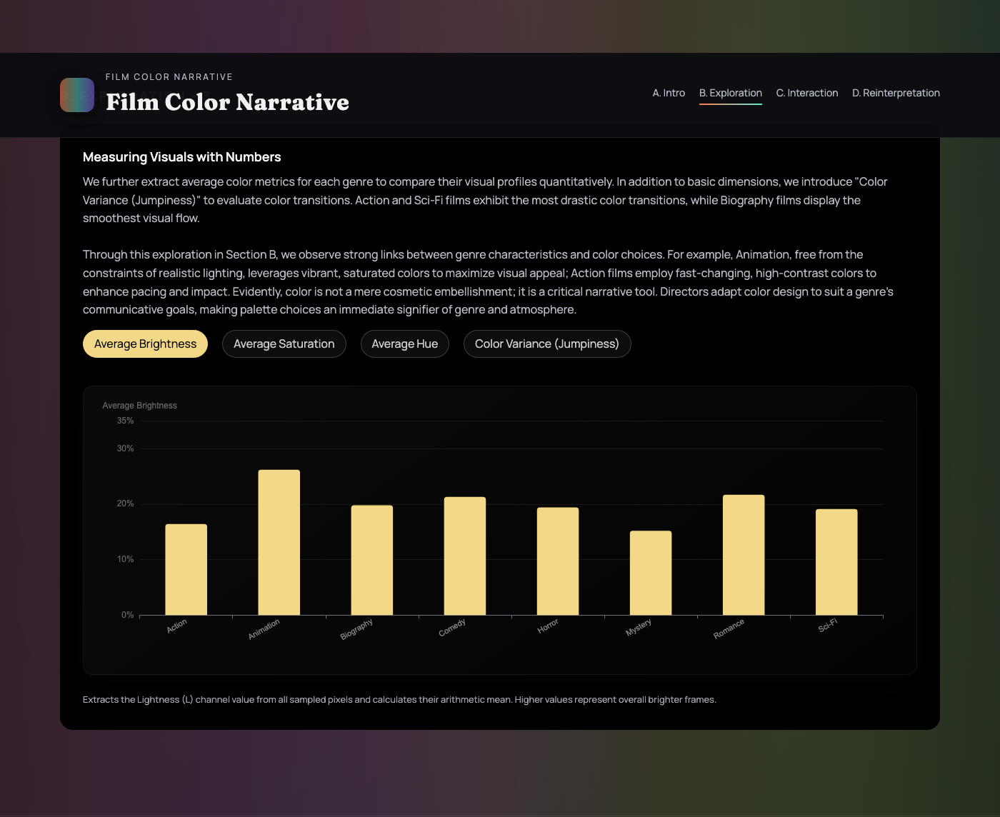
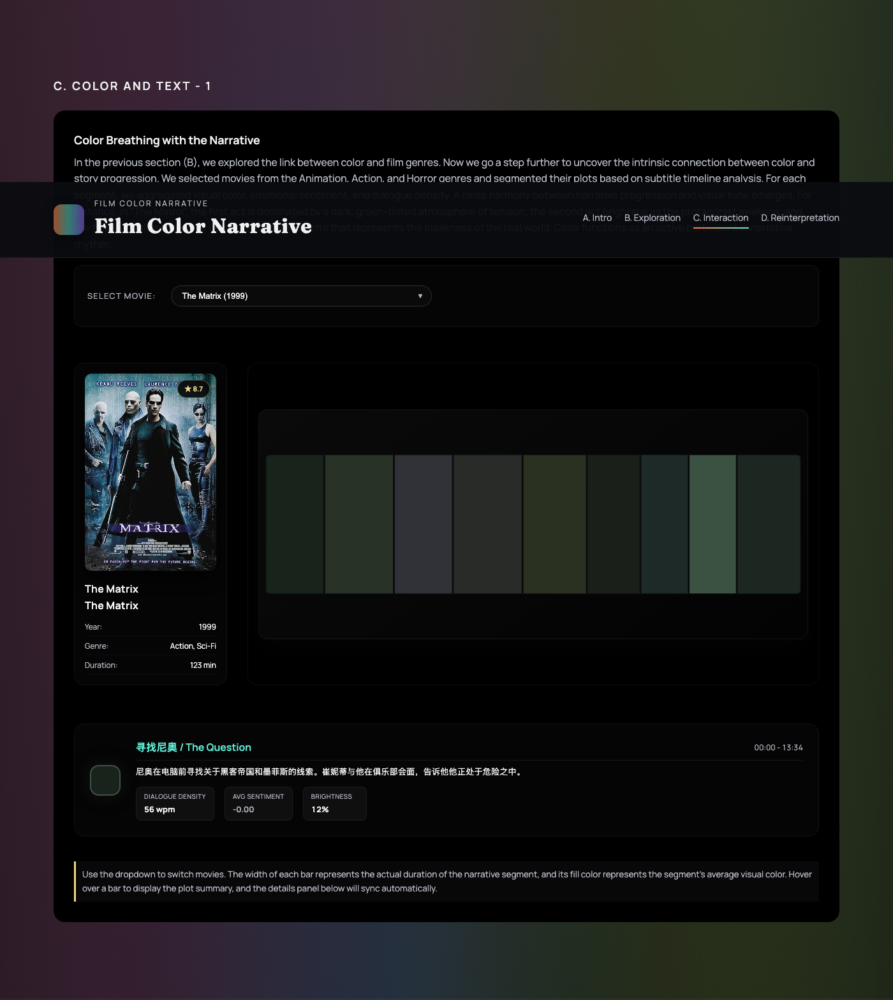
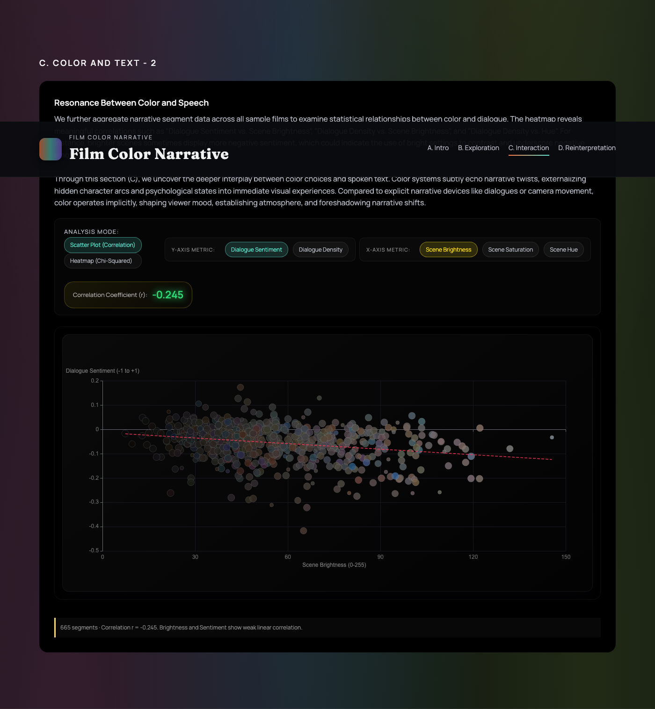
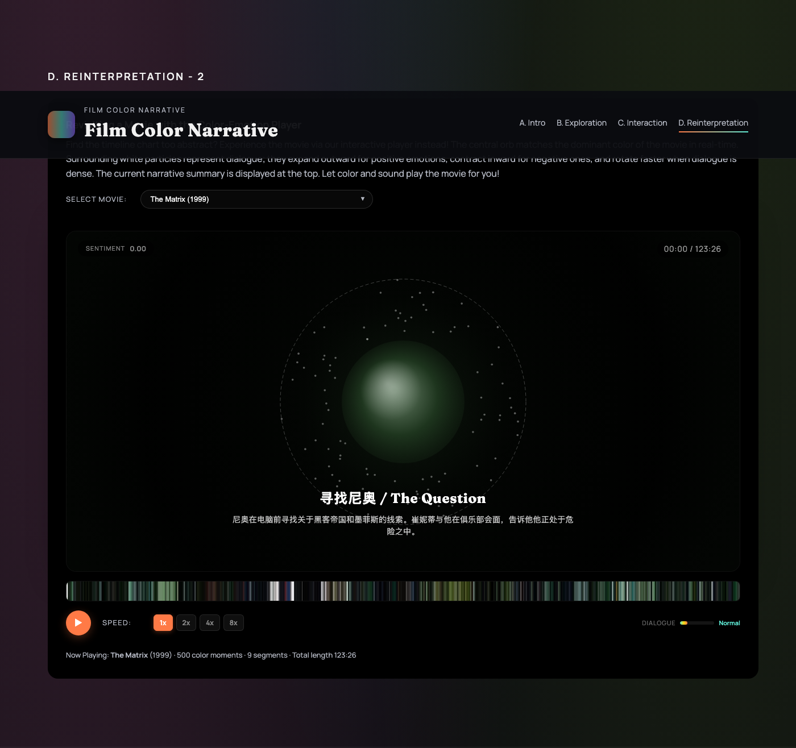
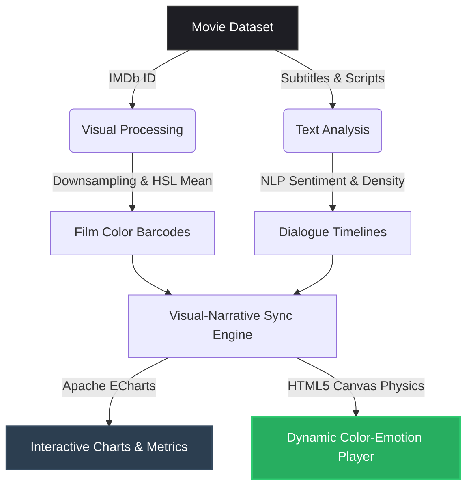

# Film Color Narrative: Visualizing the Color DNA and Sentiment of Cinema



An interactive web-based data visualization platform that explores the visual and narrative structures of cinema by analyzing movie color profiles ("barcodes") in tandem with dialogue scripts.

This project maps color distributions and transitions across film genres, overlays narrative arcs with script sentiment, and models the relationship between dialogue pace and scene brightness.

---

## 🚀 Interactive Features

### 1. Genre Color Fingerprints
- **Average Genre Palettes**: Aggregated visual profiles for major genres (such as Action, Sci-Fi, Animation, Horror, etc.) calculated using circular mean values in the HSL color space.
- **Interactive Modals**: Click on any genre card to inspect the dataset of films that contribute to the fingerprint.



### 2. Time-Dissected Geological Layers
- **Metric Mode**: Visualizes the proportion of Dark/Medium/Bright, Low/Medium/High Saturation, and Warm/Neutral/Cool tones stacked across different genres.
- **Original Color Mode**: Quantizes all color barcode pixels of a genre into 25 primary clusters using a median-cut color quantization algorithm, allowing direct comparison of actual genre colors.



### 3. Quantitative Visual Metrics
- Compares genres across four statistical dimensions:
  - **Average Brightness**: Arithmetic mean of the Lightness ($L$) channel.
  - **Average Saturation**: Arithmetic mean of the Saturation ($S$) channel.
  - **Average Hue**: Circular mean of the Hue ($H$) channel, rendered on an interactive hue wheel with needle pointers indicating average tone.
  - **Color Variance (Jumpiness)**: The average absolute difference in hue between adjacent timeline frames, illustrating the frequency and intensity of color transistions.



### 4. Color & Narrative Segment Alignment
- Aligns AI-generated story chapters with corresponding subtitle segments.
- Displays segment durations, visual average colors, dialogue density, and dialogue sentiment concurrently.



### 5. Dialogue Sentiment & Color Correlation
- **Scatter Plot (Pearson Correlation)**: Graphs dialogue sentiment (positive/negative indices) against scene brightness or saturation, calculating the Pearson correlation coefficient ($r$) dynamically.
- **Heatmap (Chi-Squared Test)**: Divides variables into category groupings and performs a Chi-squared contingency test to evaluate standard standardized residuals, testing whether visual palettes and screenplay dialog act independently or in correlation.



### 6. Film Color-Emotion Player
- A canvas-based interactive simulation player.
- The central orb matches the dominant color of the movie in real-time.
- Surrounding white particles represent dialogue; they expand outward for positive emotions, contract inward for negative ones, and rotate faster when dialogue is dense.
- Spacebar controls play/pause; scrubbing is supported by clicking directly on the timeline barcode.



---

## 📊 Data Pipeline and Architecture



1. **Visual Processing**: Color barcodes are generated by downsampling film frames and extracting key hues chronologically.
2. **Text Processing**: Sentiment scores (-1.0 to 1.0) and speech density (words per minute) are computed from timestamped subtitle files.
3. **Frontend Architecture**: Built using a modular single-page structure. A routing layer dynamically loads page templates via the Fetch API and initializes section-specific scripts using native ES6 modules.

---

## 🛠️ Tech Stack

- **Core**: HTML5, CSS3 (Vanilla), ES6 Javascript Modules
- **Charts & Physics Rendering**: [Apache ECharts](https://echarts.apache.org/) (for timelines, heatmaps, and scatter plots) and HTML5 Canvas (for particle systems in the player)

---

## 💻 Local Setup & Run

Due to the use of the `Fetch API` for dynamic template loading, directly opening `index.html` from the file system will trigger CORS policy restrictions. To run the project locally, serve the directory via any local web server:

### Option A: Python (Pre-installed on macOS/Linux)
Run the following in your terminal:
```bash
python3 -m http.server 8000
```

### Option B: Node.js (via npx)
Run the following in your terminal:
```bash
npx live-server .
```

After starting your server, open your browser and navigate to:
👉 **`http://localhost:8000`**

---

## 📋 License

This project is open-source and available under the [MIT License](LICENSE).
